# Student Quickstart Guide

## Installing the app

Kindly use this [link](https://github.com/priyanshagrahari/iiitr_connect/releases/download/testing/build_release_20231103.apk) to download the apk file to your phone. Once downloaded, install it (you may need to change some settings to do so) and proceed to the next steps. If you get a warning from google you can safely ignore it, and continue installing the app. The warning may appear because the app has not been 

## Logging in
When you first open the app after installation, you should see the following screen:  
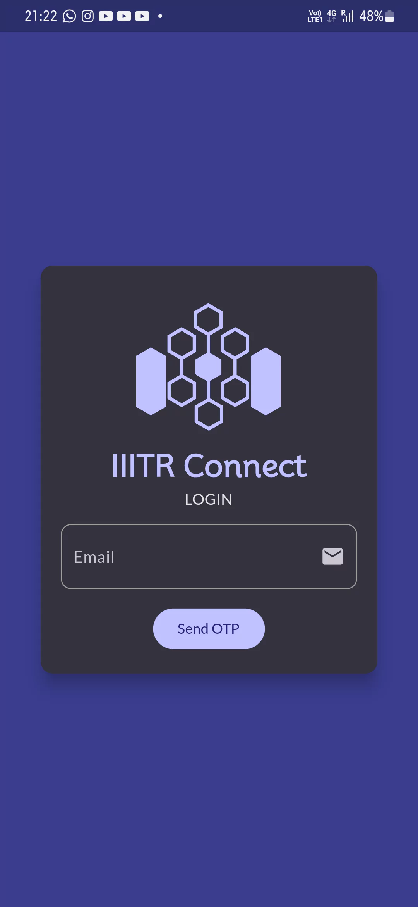  
Enter your college email address (ending in `@iiitr.ac.in`) and click on `Send OTP`.  
You should see a confirmation message stating that the OTP is being sent to the specified email. This means that your email is registered.   
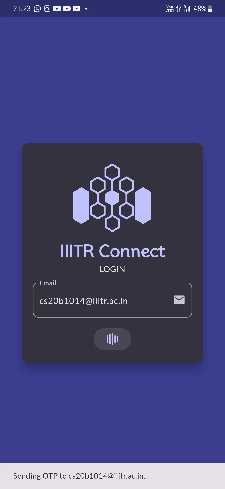  
If you instead see a message stating that the email was not found, kindly double check the email address you entered, or contact an administrator (for now, send an email to cs20b1014@iiitr.ac.in).  
Once the OTP is sent, you should get a confirmation message and be able to see the screen below:  
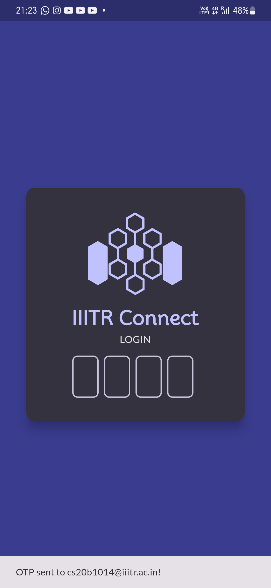  
You should recieve the OTP in a few seconds. In case you can't see it, please check your spam folder and mark the email as not spam by clicking the `Report not spam` button.  
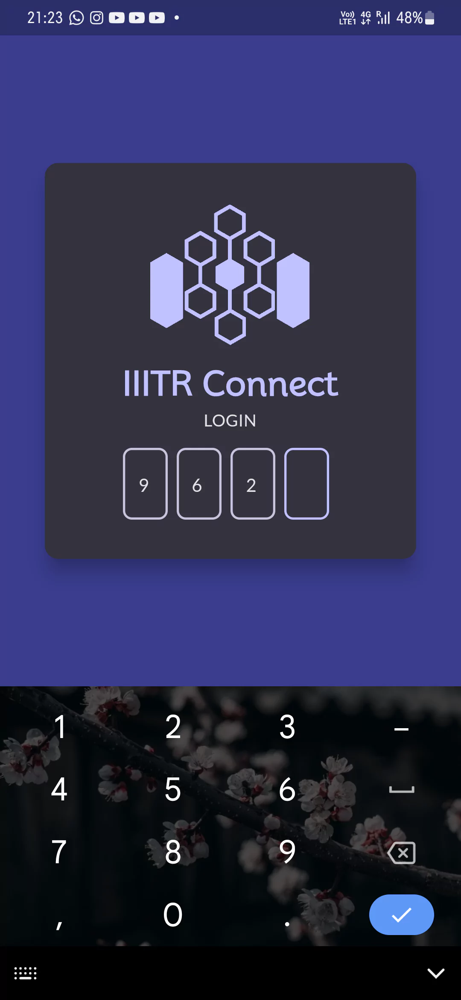  
Once you enter the 4 digit OTP, it will automatically try to log in. You should see a similar screen with your name once you have logged in:  
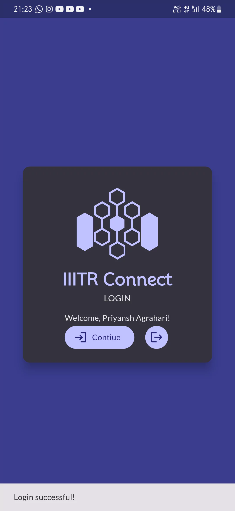  
Click on `Continue` to proceed onto the app.

## Submitting Face Data
When you first log in, you should see a dialog box like this:
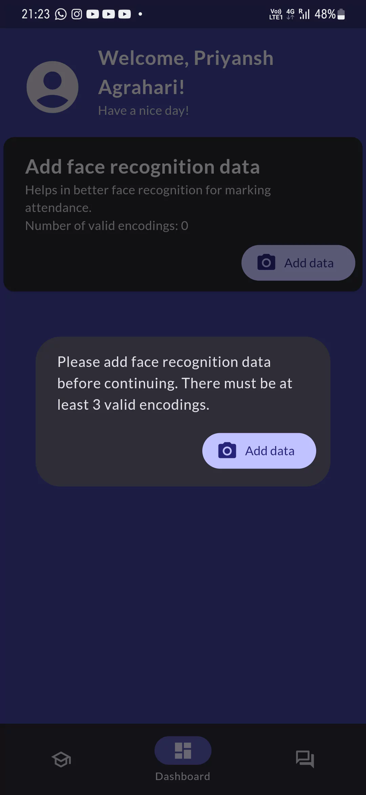  
Click on `Add data` to proceed.  
On the next screen, you will be prompted to give Camera access to the app. Choose the option equivalent to `While using the app` and proceed:  
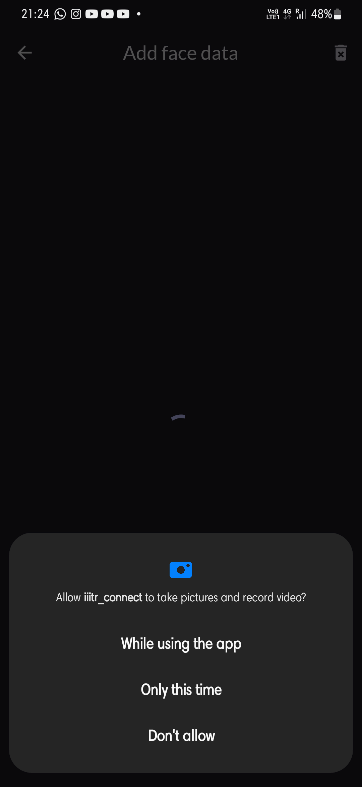  
Now, you must click 3 or more CLEAR and WELL LIT photos of your face, preferably from different angles:  
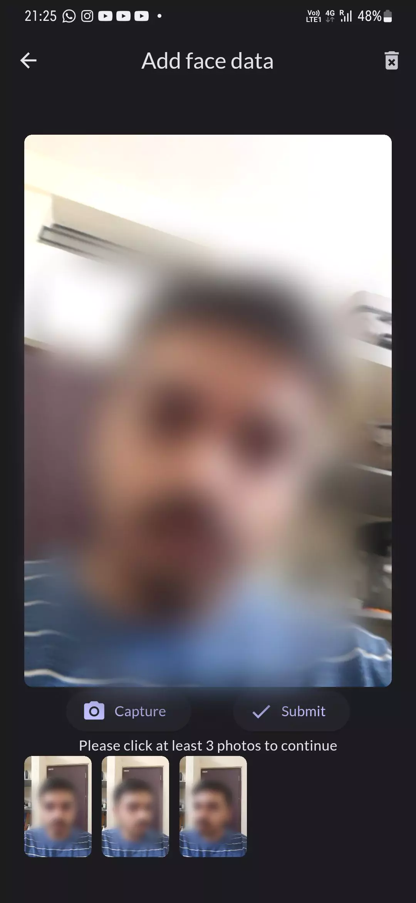  
Once you have clicked enough photos, the `Submit` button will be enabled. Click on it to proceed.  
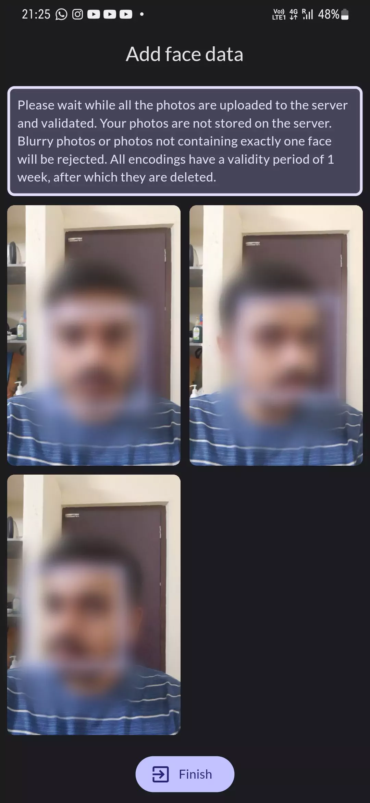  
Here, you will be able to see the status of the images you uploaded. For images that were successfully accepted, a bounding box of the detected face will be displayed. It is recommended to stay on the app while the photos are uploading. Once the `Finish` button is avaliable, you can click on it to go back to the Dashboard.  
You will be given a confirmation at the bottom of the screen and the number of valid encodings displayed on the card will also be updated.  
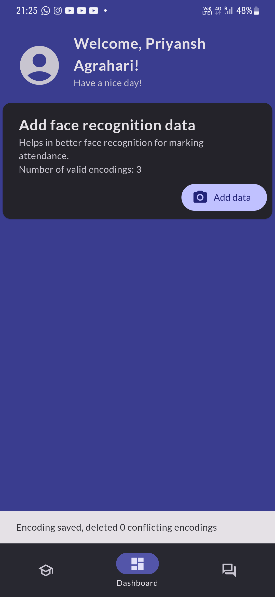  
In case less than 3 of your photos were accepted in the previous step, you will be prompted to add more.  
Click on the bottom left tab to open the Courses tab.

## Registering for courses
When you first open the Courses tab, you should see an empty screen. You can register for available courses by clicking the `Register Course` button on the bottom right:  
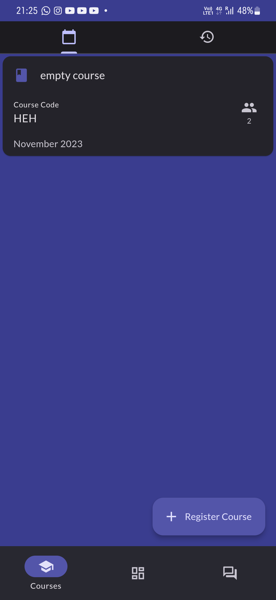  
The next screen should display a list of available courses, if any:  
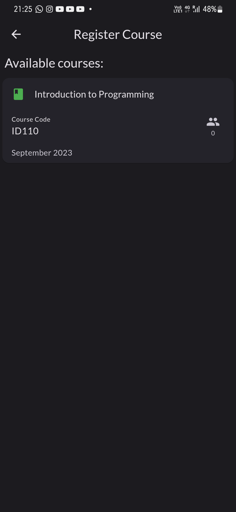  
When you select a course from the list, you will be prompted to confirm the action:  
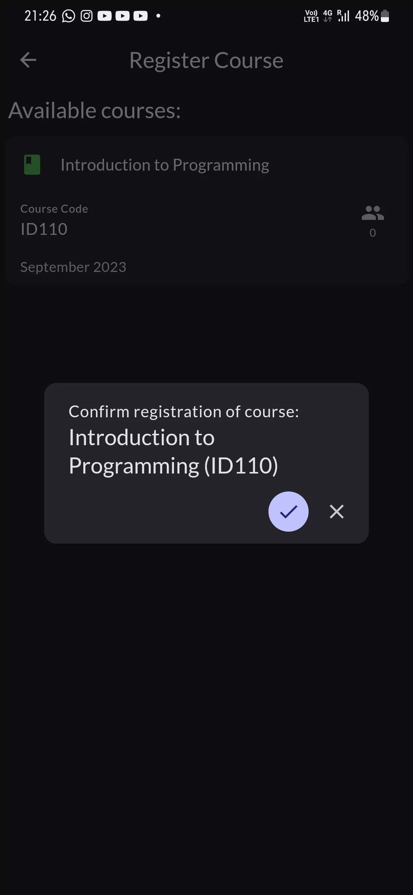  
Confirm by clicking the ☑ button.  
You will then be taken back to the Courses tab and a confirmation for successful course registration will be shown:  
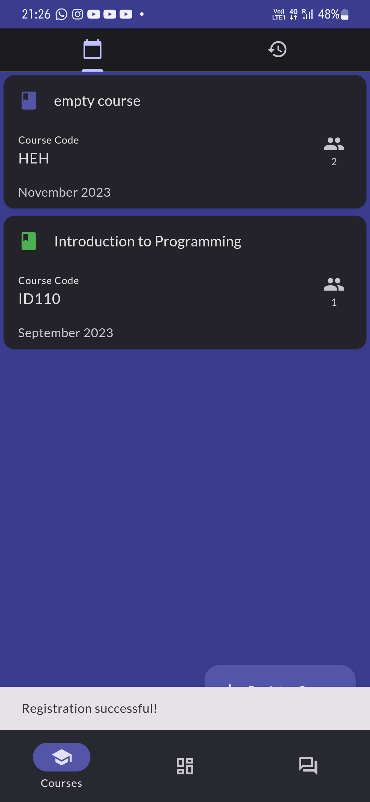  
You can select any course from the list to view the course details, registered students, and your attendance records for lectures.
